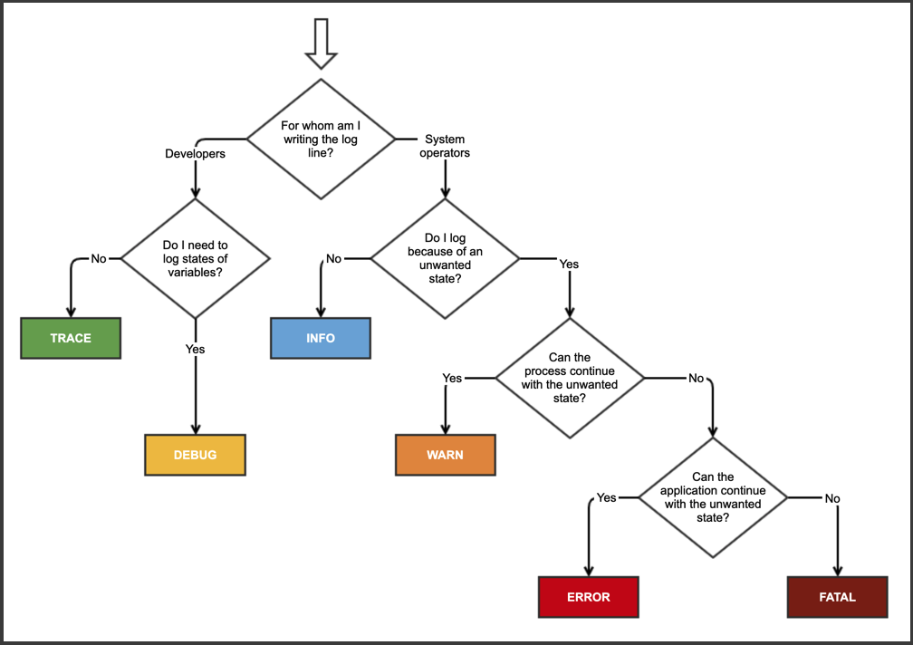

# Logging

## Goal 🎯

Logging is a critical part of any application and helps monitor and troubleshoot its behaviour in production. In this lesson you will learn how to log from your Function App. You will also learn how to include structured information to your logs and implement best practices for distributed tracing.

This lesson consists of the following exercises:

|Nr|Exercise
|---|---
|0|[Prerequisites](#0-prerequisites)
|1|[Creating a Function App](#1-creating-a-function-app)
|2|[Logging to Application Insights](#2-logging-to-application-insights)
|3|[Log levels and categories](#3-log-levels-and-categories)
|4|[Structured logging](#4-structured-logging)
|5|[Distributed tracing](#5-distributed-tracing)
|6|[Homework](#6-homework)
|7|[Cleanup Azure resources](#7-cleanup-azure-resources)
|8|[More Info](#8-more-info)

> 📝 **Tip** - If you're stuck at any point you can have a look at the [source code](../../../src/dotnet6/http/AzFuncUni.Logging) in this repository.

> 📝 **Tip** - If you have questions or suggestions about this lesson, feel free to [create a Lesson Q&A discussion](https://github.com/marcduiker/azure-functions-university/discussions/categories/lesson-q-a) here on GitHub.

---

## 0. Prerequisites

| Prerequisite | Exercise
| - | -
| Azure Functions Core Tools | 1-6
| VS Code with Azure Functions extension| 1-6
| REST Client for VS Code or Postman | 1-6
| Azure Subscription | 2-7

See [.NET 6 prerequisites](../prerequisites/README.md) for more details.

## 1. Creating a Function App

In this exercise, you'll be creating a Function App with the default HTTPTrigger to serve as a startup project for subsequent exercises.

This exercise is a condensed version of the 
[HTTP Trigger (.NET 6)](../http/README.md) lesson. Please, refer to that lesson for more in-depth review of the generated files and code

### Steps

1. In VSCode, create the Function App by running `AzureFunctions: Create New Project` in the Command Palette (CTRL+SHIFT+P).
2. Browse to the location where you want to save the function app (e.g. *AzFuncUni.Logging*).
3. Select the language you'll be using to code the function, in this lesson that is using `C#`.
4. Select `.NET 6 Isolated LTS` as the runtime.

    If you don't see .NET 6, choose:

    - `Change Azure Functions version`
    - Select `Azure Functions v4`
    - Select `.NET 6 Isolated LTS`
>  
5. Select `HTTPTrigger` as the template.
6. Give the function a name (e.g. `HelloWorldHttpTrigger`).
7. Enter a namespace for the function (e.g. `AzFuncUni.Logging`).
8. Select `Function` for the AccessRights.

    > 🔎 **Observation** - Notice that a new project has been fully generated.

9. Build the project (CTRL+SHIFT+B).
10. Run the Function App by pressing `F5`.

    > 🔎 **Observation** - Eventually you should see a local HTTP endpoint in the output.

11. Now call the function by making a GET request to the above endpoint using a REST client:

    ```http
    GET http://localhost:7071/api/HelloWorldHttpTrigger
    ```

    > 🔎 **Observation** - You should receive a `200 OK` success response.


## 2. Logging to Application Insights

You may have noticed that some lines have been printed to the Console each time the HTTP function is triggered. Unfortunately, the Console log output is very limited and does not offer much details on the structure of logs.

Most Azure Functions end up logging to Azure Monitor. In particular, _Application Insights_ is a comprehensive Application Performance Monitoring component of Azure Monitor that, amgonst other things, collects telemetry from a running application. Logs − or traces − are one of many signals of telemetry that _Application Insights_ collects.

In this section, you will learn the basics of _Application Insights_ and its _Live Metrics_ dashboard.

### Steps

1. Navigate to the Azure Portal and create [a new resource group](https://portal.azure.com/#view/Microsoft_Azure_Marketplace/GalleryItemDetailsBladeNopdl/id/Microsoft.ResourceGroup) named `AzFuncUni`, for instance.

2. Navigate to the newly created resource group and create [a new _Application Insights_](https://portal.azure.com/#view/Microsoft_Azure_Marketplace/GalleryItemDetailsBladeNopdl/id/Microsoft.AppInsights) resource. This may also create a _Log Analytics Workspace_ resource.

3. Go to the newly created resource and notice the `Essentials` section, at the top of the center pane. Please take note of the `Instrumentation Key` and `Connection String` properties.

4. Back to your local working folder, create a new `local.settings.json` project file and initialize its content with the following JSON object:

```json
{
    "IsEncrypted": false,
    "Values": {
        "FUNCTIONS_WORKER_RUNTIME": "dotnet-isolated",
        "AzureWebJobsStorage": "UseDevelopmentStorage=true;",
        "APPINSIGHTS_INSTRUMENTATIONKEY": "<paste-the-instrumentation-key>",
        "APPLICATIONINSIGHTS_CONNECTION_STRING": "<paste-the-connection-string>"
    }
}
```

> 📝 **Tip** - The `APPINSIGHTS_INSTRUMENTATIONKEY` property is being deprecated. However, at the time of writing, it is still necessary to enable _Live Metrics_ on the Azure Portal when the application is run locally.

5. Open the `host.json` file and replace its content with:

```json
{
    "version": "2.0",
    "logging": {
        "applicationInsights": {
            "samplingSettings": {
                "isEnabled": true,
                "excludedTypes": "Request"
            },
            "enableLiveMetrics": true
        },
        "logLevel": {
            "default": "Trace"
        }
    }
}
```

Our changes enable integration with the _Live Metrics_ dashboard associated with the _Application Insights_ resource that we will refer to from now on as “App Insights”, for short. We also have lowered the default _Log Level_ to `Trace` so that virtually every log emitted from the application goes out unfiltered.

6. Compile and run the application again.

7. From the Azure Portal, navigate to App Insights and display the _Live Metrics_ dashboard. You can find `Live Metrics` as one of the options available on the left pane, under the `Investigate` topic.

Wait a couple dozen of seconds for the web page to refresh and display the dashboard.

> 📝 **Tip** - Some ad blockers are known to prevent the dashboard from displaying. If you have μBlock₀, you may see a `Data is temporarily inaccessible` red banner, for instance. Make sure to disable your ad blocker for the _Live Metrics_ page to display properly.

Once the dashboard displays, notice that your machine is listed as one of the servers currently connected to App Insights.

8. On you local machine, call the HTTP-triggered function a couple of times.

    ```http
    POST http://localhost:7071/api/HelloWorldHttpTrigger
    ```

    > 🔎 **Observation** - You should notice some spikes of activity in the _Live Metrics_ dashboard and see a host of logs being recorded on the right `Sample telemetry` pane.

From the right pane, locate and click on one of the recorded logs, with the following message text: `"C# HTTP trigger function processed a request"`.

Details from the selected log are displayed on the lower right pane. In particular, notice the following two properties:

- `Category`: `Function.HelloWorldHttpTrigger.User`
- `LogLevel`: `Information`

Along with their messages, those are amongst the most important properties from the collected logs.
In the next section, you will dive into those properties in a bit more details.

9. Hit <kbd>Ctrl</kbd>+<kbd>C</kbd> from the Console of the running application to stop its execution.

## n. Log levels and categories

In this section, you will learn the basics of _Application Insights_ and its _traces_ log store.
You will also learn about _Log Categories_ and how to filter log output based upon _Log Levels_ and categories.

### Overview

> 📝 **Tip** - App Insights is a comprehensive Application Performance Monitoring (APM) solution. As such, it does a lot more than collecting traces from a running application. In this lesson, you will mostly focus on interacting with App Insights using .NET's [Microsoft.Extensions.Logging.ILogger](https://learn.microsoft.com/en-us/dotnet/core/extensions/logging?tabs=command-line) abstraction.

As you have seen on the previous section, each log is associated with a set of properties, two of which are its _Category_ and _Log Level_.

#### Log levels

The log level is a measure of how critical or urgent an event reported by the application is. Using an appropriate log level, you can separate logs that simply convey useful information on how your application behaves from errors that are raised as part of its execution.

More importantly, log levels offer a way to regulate the amount of data that is transmitted to your monitoring system. For App Insights, this is a good way to limit the charges incurred by the service.

When troubleshooting is needed, additional insights can be gained by increasing the level of logs momentarily. This can be done dynamically without impacting the running application.

When to use what level for logging falls outside the scope of this lesson.
However, you may like [this simple chart](https://stackoverflow.com/a/64806781) that I found online.



Credit: [Taco Jan Osinga](https://stackoverflow.com/users/3476764/taco-jan-osinga) (2020) - [When to use the different log levels](https://stackoverflow.com/questions/2031163/when-to-use-the-different-log-levels) - [Stack Overflow](https://stackoverflow.com/).

The [ILogger](https://learn.microsoft.com/en-us/dotnet/api/microsoft.extensions.logging.loglevel) abstraction used within Azure Functions defines the following log levels:

- `LogLevel.Trace`
- `LogLevel.Debug`
- `LogLevel.Information`
- `LogLevel.Warning`
- `LogLevel.Error`
- `LogLevel.Critical`
- `LogLevel.None`

Using `LogLevel.None` effectively disables log output.

In the previous exercise, you have seen how setting the default log level for the entire application to `"Trace"` in the `host.json` file dramatically increased the amount of traces emitted when running the application. Changing the default level is a crude way to limit the quantity of logs. Later in this exercise, you will learn to configure log levels for particular _categories_ of logs.

### Categories

Logs are divided into multiple _categories_, which form a set of hierachical namespaces.
Splitting logs into multiple categories allows you to associate appropriate log levels to each category.

By default, each `ILogger` instance is associated with a category hierarchy based upon the full type name of its corresponding dotnet class.

As a [rule of thumb](https://learn.microsoft.com/en-us/dotnet/core/extensions/logging?tabs=command-line#log-category), each dotnet class has a full type name that represents a category hierarchy for the purpose of logging. However, functions in your Function App behave slightly differently.

Before running the code from your functions, the Functions Runtime first runs the code associated with any trigger and input bindings associated with parameters to your functions. Likewise, after having executed your code, the Functions Runtime runs the code associated with return and output bindings that you may have specified.

For this reason each function decorated using the [`FunctionNameAttribute`](https://learn.microsoft.com/en-us/azure/azure-functions/functions-dotnet-class-library?tabs=v4%2Ccmd#methods-recognized-as-functions) class emits logs associated with the following category hierarchy:

- `Functions.<function-name>`: category associated with logs from your triggers and bindings used by your function.
- `Functions.<function-name>.User` category associated with logs from your code using `ILogger` instance supplied as a parameter to your function.

In this exercise, you will discover log categories and learn how to filter log output based upon categories using appropriate log levels.

### Steps

1. Open the Azure Portal and navigate to App Insights.
2. On the left pane, click on `Logs` option under the `Monitoring` topic.
3. Close the `Welcome to Application Insights` screen.
4. On the `Queries` screen, uncheck the `Always show Queries` option and close the screen.

    > 🔎 **Observation** - This is the main interface in App Insights. You will use this interface to write and execute queries on collected telemetry. This screen has a left panel that displays the App Insights tables, amongst which you should see one named `traces`.

    > 📝 **Tip** - Double-click on the `traces` table to start a new query and click the `▶️ Run` button. You should see a list of logs in the results pane at the bottom of your screen.

5. Use a query to discover log categories emitted by your application:

    Replace the query with the following text:

    ```sql
    traces 
    | summarize count(message) by tostring(customDimensions.Category)
    | order by customDimensions_Category
    ```

    > 📝 **Tip** - App Insights uses a SQL-like query language named [Kusto Query Language](https://learn.microsoft.com/en-us/azure/data-explorer/kusto/query/) (KQL).

    > 🔎 **Observation** - The query breaks down the number of logs associated with each category. This is an easy way to get hold of the category associated with each log. You may want to use this method if you see spurious logs that you would like to filter in the future.
    
    Please, note that most log categories share only a handful of common "top-level" prefixes. In practice, the most common category hierarchies are:

	- `Azure`
        - `Azure.Core`
    - `Microsoft`
        - `Microsoft.Azure`
        - `Microsoft.Extensions`
        - `Microsoft.AspNetCore`
    - `Host`
        - `Host.General`
        - `Host.Startup`
    - `Function`
        - `Function.<function-name>`
            - `Function.<function-name>.User`
    - `System`


6. Armed with this knowledge, filter the log output from your application.

    In the `host.json` file, update the `loglevel` section to look like:

    ```json
    "logLevel": {
        "default": "Warning",
        "Function.HelloWorldHttpTrigger.User": "Information"
    }
    ```

7. Compile and run the application.
8. Call the HTTP-triggered function multiple times.

    ```http
    POST http://localhost:7071/api/HelloWorldHttpTrigger
    ```

9. In App Insights, change the `Time range` to `Last 30 minutes` and run the log category break down query again.

    ```sql
    traces 
    | summarize count(message) by tostring(customDimensions.Category)
    | order by customDimensions_Category
    ```

    > 🔎 **Observation** - After a few minutes, you should see a dramatic reduction in the amount of categories under which your application logs. In fact, given enough time, only logs associated with the `Function.HelloWorldHttpTrigger.User` category hierarchy should be emitted.

10. Hit <kbd>Ctrl</kbd>+<kbd>C</kbd> from the Console of the running application to stop its execution.

11. Update log levels while the application is running

    Once deployed to Azure, you Function App `host.json` file cannot easily be modified. To change the level associated with a given log category while the application is running, you can update the Function App’s _App Setttings_.

    Notice that in `host.json`, the full "path" to a particular log level directive looks like:

    `` logging / loglevel / <category> ``

    To represent this hiearchy in _App Settings_, use a `__` double-underscore separator and replace the `.` separator with a single `_` underscore character.

    When run locally, _App Settings_ are specified in `local.settings.json`.
    Update this file and add the following two properties:

    ```json
    {
        "Values": {
            …
            "LOGGING__LOGLEVEL__DEFAULT": "DEBUG",
            "LOGGING__LOGLEVEL__FUNCTION_HELLOWORLDHTTPTRIGGER": "TRACE"
        }
    }
    ```

    // TODO: from Visual Studio Code

## 4. Structured logging

In this exercise, …

### Steps

## 5. Distributed tracing

In this exercise, …

### Steps

## 6. Homework

In this exercise, …

### Steps

## 7. Cleanup Azure resources

In this exercise, you will cleanup Azure resources to prevent unwanted recurring charges.

### Steps

1. Navigate to the Azure Portal locate and delete the `AzFuncUni` resource group. This will automatically remove all resources that have been created as part of this lesson. For the record, you may need to remove:

- The default _Log Analytics Workspace_ resource.
- The test _Application Insights_ resource.
- The resource group.

2. Remove the _Function App_ resource you may have deployed when doing your homework.

## 8. More info

- [Log Levels Explained](https://betterstack.com/community/guides/logging/log-levels-explained/)